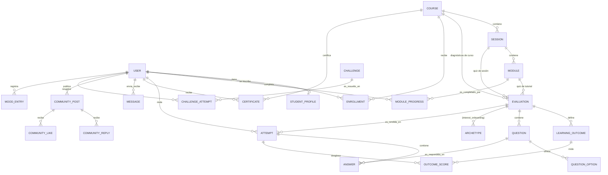

# EQUIdata — Documento de Requerimientos Técnicos

> **Actualización 2026-09-24 (M10):** la app corre solo contra Supabase; el modo `mock` salió de la ejecución y queda para tests. Cambiaron la autenticación (login de un solo paso, rol en el token), la capa de datos (consultas en bloque, listas sin HTML) y las pantallas (caché con TanStack Query). Las secciones 5.3, 5.4, 5.6, 6.3, 7, 10 y 12 están actualizadas; el resto sigue vigente. Detalle en `140826-planspec.md` (M10).
>
> Estado del producto al 2026-08-24: **MVP funcional, M0–M9 completos**, corriendo en modo `mock` (datos en memoria) o modo `supabase` (Postgres + Auth + Storage + RLS reales) según la variable `NEXT_PUBLIC_DATA_SOURCE`. Este documento describe el sistema **tal como está implementado**, no solo lo planeado — construido leyendo `src/lib/domain/types.ts`, `src/lib/data/repository.ts`, `src/lib/logic/*.ts`, `supabase/migrations/*.sql` y las especificaciones previas (`260813_desing-spec.md`, `140826-planspec.md`, `contexto.md`).
>
> Nota de alcance: `CLAUDE.md` (el brainstorming original del 13/08/2026) describe **Retos** como "fachada". El código actual (`Challenge`/`ChallengeAttempt`, `src/lib/student/challenges.ts`, `ChallengeViewer.tsx`) lo implementa como funcionalidad real desde M9 — este documento sigue el código, no el brainstorming inicial, allí donde difieren.

---

## 1. Resumen ejecutivo

**EQUIdata** es una plataforma web de e-learning para enseñar estadística aplicada a estudios del desarrollo y género, de uso interno de la Fundación WWB Colombia. Los estudiantes recorren cursos organizados en sesiones y módulos, rinden un diagnóstico inicial y uno final, resuelven quizes que condicionan el avance, y obtienen un certificado verificable al completar el curso. El profesor/admin (una sola cuenta con todos los permisos) diseña ese contenido, define las reglas de evaluación y hace seguimiento del avance de cada estudiante.

El principio arquitectónico rector — "que la base aguante" — significa que **ninguna pantalla ni lógica de negocio conoce la fuente de datos**: todo pasa por una interfaz de repositorio única (`Repository`), implementada hoy por `MockRepository` (memoria) y `SupabaseRepository` (Postgres real), intercambiables por una variable de entorno sin tocar una sola pantalla.

---

## 2. Actores y roles

| Actor | Descripción | Autenticación | Permisos |
|---|---|---|---|
| **Estudiante** | Colaborador de la Fundación que cursa contenidos de estadística. Sin formación estadística previa necesariamente. | Correo institucional + OTP, o Google OAuth (modo Supabase); en modo mock cualquier correo ≠ profesor. | Su propio progreso, intentos, mensajes, perfil; lectura de contenido de cursos publicados y comunidad. |
| **Profesor/Admin** | Una sola cuenta fija (`vvaloyes@fundacionwwbcol.org`), todos los permisos. No hay rol de admin separado. | Igual mecanismo que el estudiante; el **correo** determina el rol. | CRUD completo de cursos/sesiones/módulos/evaluaciones, ve y exporta calificaciones, gestiona inscripciones, envía mensajes, configura listas y campos de onboarding, reabre intentos. |
| **Visitante anónimo** | Cualquiera con un enlace de verificación de certificado. | Ninguna (ruta pública). | Solo lectura de `/verify/[code]`. |

El rol se asigna **una sola vez**, al crear la cuenta:
- Modo mock: `isTeacherEmail()` (`src/lib/auth/teacherEmail.ts`) compara el correo contra una constante.
- Modo Supabase: el trigger `handle_new_user` (`supabase/migrations/0002_rls.sql`) hace la misma comparación al insertar en `auth.users`, y escribe el rol en `profiles.role`. Cambiar el correo del profesor implica editar la constante **y** el trigger.

---

## 3. Casos de uso

### 3.1 Estudiante

| ID | Caso de uso | Precondición | Flujo principal | Flujos alternos |
|---|---|---|---|---|
| UC-01 | Iniciar sesión | — | Ingresa correo institucional → recibe/ingresa OTP de 6 dígitos → entra. | "Continuar con Google" (OAuth). Código incorrecto → error + reenviar. |
| UC-02 | Completar onboarding | Primer ingreso, perfil incompleto | Llena nombres, apellidos, tipo/número de documento, cargo (lista fija) y área (lista fija editable por el profesor) + campos personalizados que el profesor haya definido. | Cuenta creada antes de exigir documento → placeholder `PENDIENTE-<userId>` hasta que lo complete. |
| UC-03 | Autoinscribirse a un curso | Curso `published` y `enrollmentOpen = true` | Desde "Cursos disponibles", se inscribe con un clic. | Curso con inscripción cerrada → solo el profesor puede inscribir. |
| UC-04 | Recorrer un curso | Inscrito, diagnóstico inicial resuelto | Ve sesiones como cards (completada/en progreso/bloqueada) → entra a una sesión abierta → ve módulos (video o HTML) → completa cada uno. | Sesión bloqueada → ve el motivo exacto (fecha o quiz previo) en vez de contenido. |
| UC-05 | Rendir una evaluación (diagnóstico o quiz) | Módulos previos completos | Ve intro (preguntas, intentos disponibles) → responde → envía → ve nota + desglose por RA. | Sin intentos disponibles → bloqueado, con opción de esperar (diagnóstico final) o pedir reapertura al profesor. |
| UC-06 | Ver comparación pre/post | Diagnóstico inicial y final ambos rendidos | Ve, por cada resultado de aprendizaje, dónde empezó vs. dónde quedó. | — |
| UC-07 | Obtener certificado | Diagnóstico final aprobado (≥ passing) y curso 100% completo | Ve el certificado disponible → lo descarga (imagen PNG) → puede compartir el código de verificación. | Elegibilidad no cumplida → ve el motivo específico (curso incompleto vs. final no aprobado). |
| UC-08 | Practicar en repaso | Completó al menos una sesión | Ve, en el dashboard, los módulos ya vistos de la sesión N y N-1 sugeridos como repaso. | — |
| UC-09 | Usar tutoriales sueltos | — | Abre un tutorial (video/HTML) fuera de cualquier curso; si tiene quiz, lo resuelve igual que un quiz de curso pero sin RA ni certificado. | — |
| UC-10 | Resolver un reto | — | Abre un reto (HTML autocalificado) → interactúa → el propio HTML reporta el resultado por `postMessage` → se guarda como intento, reintentable. | — |
| UC-11 | Enviar/leer mensajes | — | Bandeja bidireccional con el profesor y compañeros. | — |
| UC-12 | Participar en comunidad | — | Publica, da like (toggle) y responde posts públicos, visibles para ambos roles. | Puede ocultar su nombre real (`showNameInCommunity`). |
| UC-13 | Registrar ánimo diario | — | Elige un estado de ánimo del día (una entrada por día, se reemplaza si repite el mismo día). | — |
| UC-14 | Ver calendario | — | Vista de solo lectura agregando fechas de desbloqueo, evaluaciones y eventos. | — |
| UC-15 | Editar configuración personal | — | Cambia foto de perfil, nombre visible, preferencias de notificación y privacidad de comunidad. | — |

### 3.2 Profesor/Admin

| ID | Caso de uso | Flujo principal |
|---|---|---|
| UC-16 | Crear/editar curso | Título, descripción, portada, texto y duración (horas) del certificado, publicado/borrador, inscripción abierta/cerrada. |
| UC-17 | Crear sesiones y módulos | Sesiones con orden y fecha de liberación; módulos (video/HTML) con orden dentro de la sesión. |
| UC-18 | Crear diagnóstico/quiz con RA | Define resultados de aprendizaje y su nivel esperado, agrega preguntas (5 tipos), asocia cada pregunta a un RA, configura intentos/espera/nota de aprobación, ubica el quiz tras un módulo. |
| UC-19 | Crear onboarding de intereses | Igual constructor de evaluación, pero define arquetipos en vez de RA; cada opción de respuesta suma voto a un arquetipo. |
| UC-20 | Crear tutorial + quiz simple | Tutorial suelto con quiz opcional (preguntas + % de aprobación + intentos, sin RA). |
| UC-21 | Gestionar inscripciones | Inscribe/desinscribe estudiantes uno a uno desde el detalle del curso o del estudiante. |
| UC-22 | Ver y exportar calificaciones | Tabla de intentos por evaluación; exporta CSV con nota global, desglose por RA y respuesta exacta por pregunta. |
| UC-23 | Reabrir intentos | Cuando un estudiante agotó sus intentos, le otorga uno extra (efecto inmediato en `attemptGate`). |
| UC-24 | Ver dashboard con KPIs | Estudiantes activos, cursos activos, progreso promedio, quizzes rendidos, distribución de progreso, rendimiento por evaluación, actividad reciente — filtrable por curso. |
| UC-25 | Ver progreso por estudiante | Detalle de un estudiante: cursos, avance, inscribir/desinscribir. |
| UC-26 | Enviar mensajes | Individual o a todos los inscritos de un curso. |
| UC-27 | Configurar listas y campos | Agrega/quita opciones de área; crea campos de onboarding personalizados (texto o lista) sin tocar código. |
| UC-28 | Moderar/participar en comunidad | Mismo feed que el estudiante, sin controles de moderación adicionales en esta v1. |

### 3.3 Visitante anónimo

| ID | Caso de uso | Flujo principal |
|---|---|---|
| UC-29 | Verificar certificado | Abre `/verify/[code]` sin sesión → el sistema busca el certificado por código público → muestra los datos del snapshot (nombre, curso, profesor, fecha, duración) o "no encontrado". |

---

## 4. Historias de usuario

Formato: *Como \<rol\>, quiero \<acción\>, para \<beneficio\>* + criterios de aceptación (Given/When/Then). Agrupadas por épica; reflejan reglas ya implementadas, no propuestas.

### Épica: Ingreso y perfil

**HU-01.** Como estudiante, quiero entrar con mi correo institucional y un código, para no necesitar una contraseña.
- Given un correo institucional válido, When pido el código y lo ingreso correctamente, Then entro a mi dashboard.
- Given un código incorrecto, When lo envío, Then veo un error y puedo pedir uno nuevo.

**HU-02.** Como estudiante nuevo, quiero completar mi perfil una sola vez, para que mis datos (cargo, área, documento) queden limpios y agrupables en las métricas del profesor.
- Given es mi primer ingreso, When termino el onboarding, Then no se me vuelve a pedir y puedo editarlo después desde Configuración.
- Given el profesor agregó un campo personalizado, When completo el onboarding, Then ese campo aparece en el formulario sin que se haya tocado código.

### Épica: Recorrido de curso

**HU-03.** Como estudiante, quiero ver claramente qué sesiones puedo abrir y cuáles no, para saber qué me falta.
- Given una sesión con fecha futura, When la veo en la lista, Then aparece bloqueada con el texto "Disponible a partir del \<fecha\>".
- Given el quiz de la sesión anterior sin resolver, When la fecha de la sesión ya llegó, Then sigue bloqueada con el texto "Resuelve el quiz de la sesión anterior".
- Given ambas condiciones cumplidas, When entro, Then veo sus módulos.

**HU-04.** Como estudiante, quiero que mi progreso se registre módulo por módulo, para retomar exactamente donde quedé.
- Given completo todos los módulos de una sesión (y su quiz, si tiene, resuelto), When vuelvo al curso, Then la sesión aparece como completada.

### Épica: Evaluaciones

**HU-05.** Como estudiante, quiero conocer mi resultado por dimensión temática (no solo la nota global), para saber en qué reforzar.
- Given una evaluación con RA definidos, When la envío, Then veo cada RA con "esperábamos X%, estás en Y%", marcado como superado u oportunidad de mejora.

**HU-06.** Como estudiante, quiero comparar mi diagnóstico inicial y final por RA, para ver mi propio avance.
- Given rendí ambos diagnósticos, When veo el resultado del final, Then cada RA muestra "punto de partida → resultado final".

**HU-07.** Como estudiante, quiero que agotar mis intentos de quiz no me deje trancado, para poder seguir avanzando en el curso.
- Given agoté mis 2 intentos de un quiz sin llegar al 80%, When la fecha de la siguiente sesión ya llegó, Then la sesión se desbloquea igual, y mi nota de reporte es la más alta de mis intentos.

**HU-08.** Como estudiante, quiero reintentar el diagnóstico final cuantas veces haga falta, para poder obtener mi certificado.
- Given agoté una tanda de 2 intentos sin aprobar, When intento de nuevo antes de 8 horas, Then el sistema me lo impide y me muestra cuándo se habilita la siguiente tanda.
- Given ya pasaron las 8 horas, When intento de nuevo, Then puedo rendir otra tanda de 2, sin límite total de tandas.

**HU-09.** Como profesor, quiero poder otorgar un intento extra a un estudiante puntual, para casos excepcionales sin cambiar la regla general.
- Given un estudiante agotó sus intentos, When le reabro uno desde Calificaciones, Then puede rendir un intento adicional de inmediato.

### Épica: Certificación

**HU-10.** Como estudiante, quiero saber exactamente qué me falta para obtener mi certificado, para poder actuar sobre ello.
- Given no he completado todos los módulos, When reviso mi certificado, Then veo "Completa todos los módulos del curso".
- Given completé el curso pero no aprobé el final, When reviso mi certificado, Then veo "Aprueba el diagnóstico final para obtener tu certificado".
- Given cumplo ambas condiciones, When lo reviso, Then puedo descargarlo como imagen y compartir su código público.

**HU-11.** Como visitante, quiero verificar que un certificado es auténtico sin necesitar cuenta, para confiar en él.
- Given un código de certificado válido, When abro `/verify/<code>`, Then veo los datos oficiales del certificado sin iniciar sesión.

### Épica: Panel del profesor

**HU-12.** Como profesor, quiero definir resultados de aprendizaje y su nivel esperado por evaluación, para que el sistema pueda calcular la retroalimentación por dimensión automáticamente.

**HU-13.** Como profesor, quiero exportar las calificaciones a CSV con el desglose por RA y las respuestas exactas, para poder revisarlas por fuera de la plataforma.

**HU-14.** Como profesor, quiero ver el progreso de mis estudiantes agregado y filtrado por curso, para detectar quién se está atascando.

**HU-15.** Como profesor, quiero controlar si un curso se autoinscribe libremente o solo yo inscribo, para manejar cohortes cerradas cuando haga falta.

### Épica: Comunidad y comunicación

**HU-16.** Como estudiante, quiero enviar y recibir mensajes de mi profesor y compañeros, para resolver dudas sin salir de la plataforma.

**HU-17.** Como estudiante, quiero poder ocultar mi nombre real en Comunidad, para participar con más privacidad si lo prefiero.

---

## 5. Arquitectura técnica

### 5.1 Stack

| Capa | Tecnología | Notas |
|---|---|---|
| Framework | **Next.js 15** (App Router) | Route groups: `(auth)`, `(student)`, `(teacher)`, `(focus)`; middleware de protección de rutas. |
| Lenguaje | **TypeScript** (strict) | Tipos de dominio como contrato único entre capas. |
| UI | **React 19** + **Tailwind CSS v4** | Tokens de marca vía `@theme` en `globals.css`; componentes propios en `src/components/ui/` (sin librería de componentes de terceros). |
| Validación | **Zod** | `src/lib/domain/schemas.ts`, espejo 1:1 de `types.ts`; valida en el borde de cada mutación del repositorio. |
| Datos/Auth (real) | **Supabase** (Postgres + Auth + Storage) | `@supabase/supabase-js` + `@supabase/ssr`. RLS activo en las 26 tablas. |
| Caché de lecturas | **TanStack Query** (M10) | `useRepoQuery`/`useRefresh` en `src/lib/query.tsx`: lecturas compartidas entre pantallas, refresco en segundo plano tras escribir. |
| Datos de prueba | **Repositorio en memoria** (`MockRepository`) | Desde M10 solo para tests y como fuente del seed; la app no lo usa en ejecución. |
| Testing | **Vitest** | 106 tests: lógica pura (`src/lib/logic/`), caracterización de view-models, presupuesto de consultas por pantalla, auth y video. |
| Iconografía | `lucide-react` | Sin emojis-como-ícono (regla de marca). |
| Fuentes | `next/font`: Space Grotesk, Inter, JetBrains Mono | Space Grotesk 500 en títulos; JetBrains Mono en microcopy MAYÚSCULA (`.label-mono`). |

No hay backend separado (Nest.js, Express, etc.): Next.js cubre frontend, un puñado de **route handlers** (`src/app/api/*`) para operaciones puntuales (verificar correo, actualizar avatar/nombre) y el propio Supabase actúa como backend administrado (base de datos + autenticación + storage), con las reglas de acceso resueltas por RLS en vez de una capa de API intermedia.

### 5.2 Capas del código (de afuera hacia adentro)

```
Pantallas (src/app/**/page.tsx, src/components/**)
        │  nunca calculan lógica inline
        ▼
View-models (src/lib/student/*.ts, src/lib/teacher/*.ts)
        │  arman el objeto que la pantalla necesita, llaman a...
        ▼
Lógica de negocio pura (src/lib/logic/*.ts)
        │  sin React, sin red — recibe datos ya cargados, testeada con Vitest
        ▼
Repositorio — interfaz (src/lib/data/repository.ts)
        │  contrato único, funciones async
        ├──▶ MockRepository (src/lib/data/mock/) — memoria, desarrollo/demo
        └──▶ SupabaseRepository (src/lib/data/supabase/) — Postgres real
                seleccionado por getRepository() según isSupabaseMode()
```

Reglas duras de esta arquitectura (no romper):
1. Ninguna pantalla importa datos mock ni el cliente de Supabase directamente.
2. Toda regla de negocio nueva vive en `src/lib/logic/`, sin acoplarse a la fuente de datos.
3. Todo modelo nuevo empieza en `src/lib/domain/types.ts`; el esquema SQL es un espejo 1:1 en snake_case.

### 5.3 Fuente de datos

Desde M10 hay una sola: `getRepository()` (`src/lib/data/index.ts`) devuelve siempre `SupabaseRepository`. Se eliminaron `NEXT_PUBLIC_DATA_SOURCE` e `isSupabaseMode()`. La interfaz `Repository` se mantiene: las pantallas siguen sin conocer la implementación, y `MockRepository` la implementa para los tests.

### 5.4 Autenticación

- **Ingreso de un solo paso** (M10): correo → `signInWithOtp` (crea la cuenta si no existe) → código de 6 dígitos → `verifyOtp`. No hay pestañas "iniciar sesión/registrarse" ni endpoint de verificación de correo previo; la cuenta nueva completa su perfil con `ProfileCompletionModal`. Los errores de Supabase se traducen a mensajes en español (`src/lib/auth/authErrors.ts`). "Continuar con Google" se muestra solo con `NEXT_PUBLIC_GOOGLE_AUTH_ENABLED=true`.
- **Rol**: lo asigna una sola vez el trigger `handle_new_user` al crear la cuenta. Desde M10 viaja además en el token como claim `user_role` (Custom Access Token Hook, `0006_auth_hook.sql`). El middleware lo lee con `getClaims()` sin consultar la base; si el hook no está activo, `src/lib/auth/role.ts` cae a `profiles`.
- **`AuthContext`** expone `user`, `loading`, `logout` y `refreshUser`. Una sola fuente (`onAuthStateChange` con `INITIAL_SESSION`); `loading` sigue activo mientras carga el perfil, así no hay rebote a `/login` tras el código. Las consultas se difieren fuera del callback. La caché de datos se vacía al cerrar sesión o cambiar de cuenta.
- **Protección de rutas**: `useRequireAuth` (cliente) + `src/middleware.ts` (servidor, siempre activo; incluye `/settings`). Sin sesión redirige a `/login`, y a cada quien a su propio dashboard si entra al área del otro rol.
- **Acceso rápido de desarrollo** (M10 · F1b): `/api/dev/login` + panel en el login para entrar como cualquier cuenta existente sin correo. Solo con `NODE_ENV=development` y `DEV_QUICK_LOGIN=true`; en producción responde 404 (verificado sobre un build de producción).

### 5.5 Seguridad — Row Level Security (Supabase)

Principio de paridad: `MockRepository` no filtra lecturas (todo el seed vive en memoria de cada sesión de navegador), así que en Supabase el **contenido** de cursos/evaluaciones/preguntas/retos es de lectura abierta a cualquier autenticado (igual comportamiento), y lo que sí se protege de verdad es:

| Recurso | Lectura | Escritura |
|---|---|---|
| Cursos, sesiones, módulos, evaluaciones, preguntas, opciones, arquetipos, retos, listas de configuración | Cualquier autenticado | Solo profesor (`is_teacher()`) |
| Perfil de estudiante, inscripciones, progreso, intentos, respuestas, ánimo diario | Dueño o profesor | Dueño o profesor |
| Mensajes | Remitente, destinatario o profesor | Insertar: solo como uno mismo o profesor. Marcar leído: solo el destinatario o profesor |
| Comunidad (posts/likes/respuestas) | Cualquier autenticado | Solo como uno mismo |
| Certificados | **Pública** (incluye anónimos — requisito de `/verify/[code]`) | El propio dueño o el profesor |

`is_teacher()` es una función `security definer` que consulta `profiles.role`. Todas las tablas (26) tienen RLS habilitado; no hay tablas sin política.

### 5.6 Testing y calidad

- `npm test` → Vitest, 106 tests. Lógica pura (`grading`, `unlock`, `attempts`, `review`, `certificate`, `gamification`, `archetype`), más desde M10:
  - `viewModels.characterization.test.ts`: congela lo que entrega cada view-model;
  - `queryBudget.test.ts`: tope de consultas por pantalla, sin repeticiones;
  - auth y video.
- `npx tsc --noEmit` → chequeo de tipos.
- `npm run lint` → ESLint (config Next.js).
- No hay tests de integración de UI ni end-to-end en esta ronda.

---

## 6. Modelo de datos

### 6.1 Diagrama conceptual



### 6.2 Diccionario de entidades

Fuente de verdad: [`src/lib/domain/types.ts`](src/lib/domain/types.ts). Espejo SQL 1:1 en snake_case: [`supabase/migrations/0001_schema.sql`](supabase/migrations/0001_schema.sql).

| Entidad | Campos clave | Notas de negocio |
|---|---|---|
| **User** | id, email, role, displayName, avatarUrl?, lastSeen? | Rol fijo desde la creación. |
| **StudentProfile** | userId, nombres, apellidos, cargo, area, documentType, documentNumber, customFields?, completed, showNameInCommunity?, notifyUnreadMessages?, notifyStreakReminder? | `cargo` es lista fija de la Fundación. `area` es lista editable por el profesor. `customFields` se puebla dinámicamente desde `OnboardingFieldDef`. |
| **OnboardingFieldDef** | id, label, type (text\|select), options?, order | Constructor genérico de onboarding — el profesor agrega preguntas sin tocar código. |
| **Course** | id, title, description, certificateDescription?, certificateDurationHours?, coverUrl?, published, enrollmentOpen, teacherName | `certificateDurationHours` es escrito por el profesor (no se calcula sumando módulos); si falta, cae a la suma de `Module.durationMin`. |
| **Session** | id, courseId, order, title, unlockDate? | `unlockDate` es una de las dos condiciones de desbloqueo. |
| **Module** | id, sessionId\|null, context (course\|tutorial), order, type (video\|html), title, description, videoUrl?, contentHtml?, durationMin? | `sessionId = null` cuando es tutorial suelto. HTML se renderiza aislado. |
| **Evaluation** | id, courseId?, sessionId?, tutorialModuleId?, kind, title, maxAttempts, waitHours, passingScore?, isActive, placementAfterModuleId? | `kind`: diagnostic_initial, quiz, diagnostic_final, interest_onboarding, tutorial_quiz. |
| **LearningOutcome** | id, evaluationId, code, name, expectedLevel | Dimensión temática con nivel esperado (%); no aplica a `interest_onboarding`. |
| **Question** | id, evaluationId, order, type, text, imageUrl?, points, outcomeId?, correctValue?, tolerance? | Tipos: single, multiple, open, scale, ranking. |
| **QuestionOption** | id, questionId, text, imageUrl?, isCorrect?, correctRank?, archetypeId? | `archetypeId` reemplaza `isCorrect` en preguntas de `interest_onboarding`. |
| **Archetype** | id, courseId, name, description, order | Resultado del onboarding de intereses (no calificable). |
| **Enrollment** | userId, courseId, enrolledAt | Manual (profesor) o autoinscripción (si `enrollmentOpen`). |
| **ModuleProgress** | userId, moduleId, completed, completedAt? | Base de la racha (`computeStreak`) y del cálculo de % de curso. |
| **Attempt** | id, userId, evaluationId, startedAt, submittedAt?, score?, status | `status`: in_progress \| submitted. |
| **Answer** | id, attemptId, questionId, selectedOptionIds?, openText?, scaleValue?, rankingOrder?, pointsAwarded?, isCorrect? | Forma varía según `Question.type`. |
| **OutcomeScore** | attemptId, outcomeId, expected, achieved | Alimenta la retro por RA y el pre/post. |
| **Message** | id, fromUserId, toUserId, courseId?, body, createdAt, read | Bidireccional, sin adjuntos ni hilos. |
| **CommunityPost/Like/Reply** | ver types.ts | Feed público, escritura solo como uno mismo. |
| **Certificate** | code, userId, courseId, studentName, courseTitle, courseDescription, teacherName, durationMin, issuedAt | **Snapshot** al emitir (no cambia si el curso se edita después); `code` formato `EQUI-{año}-{5 alfanum}`; emisión idempotente por userId+courseId. |
| **Challenge / ChallengeAttempt** | ver types.ts | HTML de autor autocalificado vía `postMessage`; reintentable, se guarda un intento por cada resultado reportado. |
| **MoodEntry** | userId, dayKey (YYYY-MM-DD), mood, comment?, createdAt | Una entrada por día; se reemplaza si el estudiante vuelve a elegir el mismo día. |
| **Derivados (no persisten)** | SessionUnlockState, CalendarEvent | Calculados en `src/lib/logic/`, nunca guardados. |

### 6.3 Convenciones del esquema físico

- IDs de entidades de negocio: `text` (uuid generado del lado del cliente vía `crypto.randomUUID()` prefijado) — excepto `profiles.id`, que es `uuid` porque referencia `auth.users.id` (requisito de Supabase Auth).
- Campos `order` se llaman `order_index` en SQL (palabra reservada).
- Fechas: `timestamptz`, generadas del lado del cliente (`new Date().toISOString()`), sin defaults server-side.
- Migraciones (`supabase/migrations/`), que se corren a mano en el SQL Editor de Supabase (no hay CLI vinculado):
  - `0001_schema.sql` (26 tablas);
  - `0002_rls.sql` (políticas + trigger de rol);
  - `0004_student_document.sql` (tipo/número de documento);
  - `0005_avatars_storage.sql` (bucket de Storage para fotos de perfil);
  - `0006_auth_hook.sql` (M10: rol en el token);
  - `0007_performance.sql` (M10: índices en FKs, RLS con `(select auth.uid())`/`(select is_teacher())` y políticas de escritura separadas, funciones atómicas `submit_attempt` y `grant_bonus_attempt`).

  No existe `0003`; el esquema real coincide con el repo (verificado el 24/09/2026).

---

## 7. Integración de datos

### 7.1 Contrato del repositorio

`Repository` (`src/lib/data/repository.ts`) es la única superficie que las pantallas conocen: métodos async agrupados por dominio (identidad, cursos/sesiones/módulos, inscripción/progreso, evaluaciones, arquetipos, intentos/respuestas, comunicación, comunidad, configuración, onboarding, gamificación, certificados, retos y derivados).

**Lecturas en bloque (M10).** Ningún view-model consulta dentro de un bucle. Métodos que traen en una consulta lo que antes se pedía de a una fila:
- `getCourseStructures`: sesiones + módulos + evaluaciones de varios cursos;
- `getEvaluationDetail`: preguntas + opciones + RA;
- `listCommunityFeed`;
- `listAttemptsByUser` y `listAttemptsByEvaluations`;
- `listBonusAttemptsBy*`;
- `listUsersByIds`;
- `listModuleProgressForUsers`;
- `listAllEnrollments`;
- `listAnswers/OutcomeScoresByAttempts`;
- `countUnreadMessages`.

**Escrituras en bloque o atómicas:** `submitAttempt` (RPC atómica, con respaldo si falta `0007`) y `sendMessages`.

**HTML aparte.** Las listas de módulos no traen `content_html`; `getModuleContent` lo pide al abrir el módulo.

### 7.2 `MockRepository`

Implementación en memoria, poblada por `src/lib/data/mock/seed.ts` con datos variados (nombres largos, 0% de progreso, sesiones bloqueadas). Desde M10 no la usa la app: sirve para los tests (caracterización y presupuesto de consultas) y como fuente de `scripts/seed-supabase.ts`. Replica el comportamiento de Supabase donde importa para los tests; por ejemplo, sus listas tampoco traen `contentHtml`.

### 7.3 `SupabaseRepository`

Implementa la misma interfaz contra Postgres real. La paridad de comportamiento con `MockRepository` (sobre todo en lecturas abiertas de contenido) es intencional y está documentada en los comentarios de `0002_rls.sql` — el corte de qué es "lectura abierta" vs. "dato personal" es una decisión de producto, no un accidente técnico.

- **Seed de datos reales**: `scripts/seed-supabase.ts` reutiliza *el mismo* `src/lib/data/mock/seed.ts` (no lo duplica) e inserta en Supabase, incluyendo cuentas reales de Auth para los usuarios de la semilla. Idempotente (upsert). Se ejecuta con `node --experimental-strip-types --env-file=.env.local scripts/seed-supabase.ts`.
- **Storage**: fotos de perfil se suben comprimidas (`src/lib/student/imageCompression.ts`) a un bucket de Supabase Storage; `Repository.updateAvatarUrl` guarda la URL resultante.
- **Pendiente de configuración externa**: SMTP propio para el envío de OTP (hoy corre bajo el límite default de Supabase) y el proveedor Google OAuth en el dashboard de Supabase, si se quiere usar "Continuar con Google" en producción.

### 7.4 Validación en el borde

`src/lib/domain/schemas.ts` (Zod) valida la forma de cada entidad antes de que una mutación llegue al repositorio — la misma defensa que tendría una API real antes de tocar la base de datos, útil tanto contra un formulario mal armado como contra una llamada directa al repositorio con datos incompletos.

---

## 8. Reglas de negocio

Toda regla vive en `src/lib/logic/` — funciones puras, sin React ni acceso a red, testeadas con Vitest. Se resumen aquí; el código es la fuente de verdad.

### 8.1 Calificación (`grading.ts`)
- Autocalifican: opción única (exacta), opción múltiple (conjunto exacto), ranking (orden exacto por posición), escala **con** valor esperado (dentro de tolerancia).
- No puntúan: respuesta abierta, escala **sin** valor esperado (autorreporte).
- Nota global = puntos ganados / puntos posibles de las preguntas que puntúan, redondeado a entero (0–100).
- Desglose por RA: mismo cálculo, agrupado por `outcomeId`. Una pregunta sin RA no aporta al desglose, pero sí a la nota global.

### 8.2 Desbloqueo de sesiones (`unlock.ts`)
Doble condición, evaluada en orden:
1. **Puerta de entrada**: si el diagnóstico inicial no está resuelto, todo el curso permanece bloqueado.
2. **Fecha de liberación** de la sesión ya alcanzada.
3. **Quiz de la sesión anterior resuelto** (aprobado, o intentos agotados) — no aplica a la primera sesión.

Si falta una condición, se devuelve el motivo específico (`date` | `prev_quiz` | `diagnostic_pending`) con un texto ya formateado para la UI.

### 8.3 Control de intentos (`attempts.ts`)
- **Quiz / diagnóstico inicial**: tope fijo = `maxAttempts` + intentos extra otorgados por el profesor (`bonusAttempts`). Sin espera entre intentos.
- **Diagnóstico final**: tandas de `maxAttempts` (default 2), separadas por `waitHours` (default 8) si la tanda se agota sin aprobar. **Sin tope total** — se repite hasta alcanzar `passingScore`.
- `bestScore` = nota más alta entre los intentos enviados (se usa para reportes y para decidir aprobación).
- Un quiz se considera "resuelto" (a efectos de desbloqueo) si está aprobado **o** si los intentos están agotados sin posibilidad de más en este momento.

### 8.4 Repaso (`review.ts`)
Sin modelo propio. Tras completar la sesión *N* (todos sus módulos), se sugieren como repaso los módulos ya existentes de las sesiones *N* y *N-1*. Se recalcula sobre la última sesión completa detectada, no se persiste.

### 8.5 Elegibilidad de certificado (`certificate.ts`)
Elegible si y solo si: `finalBestScore ≥ finalPassingScore` **y** `completedModules ≥ totalModules` (todos los módulos del curso). Devuelve el motivo específico cuando no se cumple una condición.

### 8.6 Gamificación real (`gamification.ts`)
- **Racha**: días consecutivos con al menos un módulo completado, terminando hoy o ayer (no se rompe si hoy aún no hay actividad — el día no ha terminado; se rompe solo tras un día completo sin ninguna).
- **Ánimo diario**: clave `dayKey` = fecha ISO del día; una entrada por día, se reemplaza si se repite.
- XP, créditos y "voces de la comunidad" (como métricas) siguen fuera de esta lógica real — ver §9.3.

### 8.7 Arquetipos (`archetype.ts`)
Cada opción elegida con `archetypeId` definido suma un voto a ese arquetipo. Gana el de más votos; empate se resuelve por menor `order` (definido por el profesor). No es calificable — no hay nota, solo resultado categórico.

### 8.8 Exportación de calificaciones (`grades-csv.ts`)
CSV (RFC 4180, con escape de comillas/comas/saltos de línea) con: estudiante, correo, evaluación, nota global, desglose por RA (logrado y esperado, por código) y una columna por pregunta con la respuesta exacta de cada estudiante.

---

## 9. Módulos funcionales (alcance por profundidad)

Corte deliberado para que la base no se desborde hacia lo cosmético — **no tocar sin decidirlo primero**.

### 9.1 Real (lógica y modelo completos)
Autenticación · onboarding (con campos configurables) · cursos → sesiones → módulos con orden · progreso por módulo/sesión · evaluaciones (diagnósticos, quizes, RA, arquetipos, tutorial quiz) con intentos/calificación · desbloqueo de sesiones · dashboard de estudiante conectado a progreso real · panel de profesor completo (CRUD, calificaciones + CSV, progreso, reabrir intentos) · mensajería bidireccional · comunidad real (posts/likes/respuestas) · certificados con verificación pública · retos (HTML autocalificado) · inscripciones (manuales y abiertas) · racha y ánimo diario.

### 9.2 Real pero mínimo
- **Calendario**: sin modelo propio, agrega fechas ya existentes (solo lectura).
- **Tutoriales**: reusan `Module`, sueltos de la jerarquía curso→sesión, sin filtros.
- **Repaso**: calculado desde progreso existente, sin contenido extra del profesor.

### 9.3 Fachada (datos quemados, sin modelo)
- **Proyectos de comunidad**: navegable, contenido de ejemplo.
- **XP / créditos**: pendientes de que retos y tutoriales tengan seguimiento propio que justifique sus reglas.
- "Competiciones" se **eliminó** del alcance en M9 — no se usará por ahora.

### 9.4 Mapa de navegación

**Sidebar estudiante**: Dashboard · Mis cursos · Calendario · Proyectos · Comunidad · Retos · Tutoriales · Certificaciones.
**Sidebar profesor**: Dashboard · Cursos · Crear curso · Tutoriales · Estudiantes · Calificaciones · Progreso · Comunidad · Mensajes · Configuración.
**Grupo `(focus)`** (sin sidebar grande, pantalla casi completa): curso/sesión, evaluación de curso, evaluación de tutorial, certificado — con `FocusTopBar` (breadcrumb + Anterior/Siguiente).
**Pública**: `/verify/[code]`, fuera de cualquier guarda de sesión.

---

## 10. Errores conocidos y mitigaciones

| Riesgo | Mitigación implementada |
|---|---|
| Código OTP no llega / incorrecto | Error concreto + "reenviar código". |
| HTML de autor mal formado | Contenido de confianza (lo escribe el profesor); se renderiza en contenedor aislado con auto-resize vía `postMessage`; la app no depende de que funcione para seguir operando. |
| Intentos de quiz agotados sin aprobar | No bloquea: la sesión se abre igual (cumplida la fecha); se registra la nota más alta; el profesor puede reabrir intentos. |
| Fecha de liberación mal configurada | El profesor puede corregirla en cualquier momento; el candado explica el motivo mientras tanto. |
| Confusión entre vista de estudiante y de profesor | Sidebars y encabezados distintos bajo una identidad visual común; guardas de ruta por rol (cliente + servidor en modo Supabase). |
| Capa de datos no aguanta a Supabase | Interfaz `Repository` única; tipos de dominio definidos desde el día uno; RLS diseñado en paridad explícita con el comportamiento de `MockRepository`. |
| Video de YouTube pegado en formato "ver" (no embebible) | `toEmbedVideoUrl()` (`src/lib/video.ts`) normaliza cualquier formato de YouTube al formato `/embed/` — aplicado al guardar y al reproducir. |
| Pantallas lentas por consultas en bucle (M10) | Métodos en bloque del repositorio; `queryBudget.test.ts` falla si una pantalla vuelve a repetir consultas. |
| Proyecto de Supabase pausado por inactividad (plan gratuito) | Workflow keep-alive cada 3 días (`.github/workflows/keep-alive.yml`). |
| Código OTP rechazado reenviado en bucle hasta el rate limit (M10) | El envío automático ocurre una vez por código escrito. |
| Intento de quiz guardado a medias por un corte de red | `submit_attempt` (0007): intento + respuestas + RA en una transacción. |

---

## 11. Fuera de alcance de esta versión

- Rol de administrador separado del profesor.
- Calificación automática de respuestas abiertas (se revisan por fuera).
- Envío de correo real fuera de Supabase Auth (OTP) — sin notificaciones transaccionales adicionales.
- App móvil nativa (es web responsive).
- Reglas definitivas de gamificación (XP, créditos) — dependen de que retos/tutoriales tengan seguimiento propio.
- Inscripción masiva de estudiantes (hoy es de a uno).
- Feature de "puntos clave en video" (overlay de IA sincronizado) — en fase de brainstorming, ver `CLAUDE.md`; bloqueada por decisión pendiente de hosting de video (YouTube no listado vs. Vimeo).

---

## 12. Pendientes por confirmar

- SMTP propio para OTP (Gmail primero, Resend con dominio propio después) y proveedor Google OAuth en el dashboard de Supabase (necesarios antes de operar con más de un puñado de cuentas reales).
- Pasos de dashboard de M10: correr `0006` y `0007`, activar el Custom Access Token Hook y las llaves de firma asimétricas.
- Privacidad en Comunidad: "ocultar mi nombre" no se respeta frente a otras estudiantes (RLS de `student_profiles`); arreglo propuesto en `140826-planspec.md`.
- Pruebas de carga con 50–100 personas (M10 · F7), aplazadas; requieren el proyecto `equidata-dev`.
- Reglas de gamificación cuando XP/créditos salgan de fachada.
- Alcance y modelo de datos de "puntos clave en video" (`CLAUDE.md`, brainstorming 2026-08-19).
- Login real por persona en **modo mock** (sigue siendo "cualquier correo = la única cuenta demo", a propósito, porque el mock es para desarrollo/demo — en modo Supabase ya está resuelto).

---

## Anexo — Referencias de código

| Tema | Archivo(s) |
|---|---|
| Tipos de dominio | `src/lib/domain/types.ts` |
| Validación | `src/lib/domain/schemas.ts` |
| Contrato de repositorio | `src/lib/data/repository.ts` |
| Selección de fuente de datos | `src/lib/data/dataSource.ts`, `src/lib/data/index.ts` |
| Repositorio mock + semilla | `src/lib/data/mock/MockRepository.ts`, `src/lib/data/mock/seed.ts` |
| Repositorio Supabase | `src/lib/data/supabase/SupabaseRepository.ts` |
| Lógica de negocio | `src/lib/logic/*.ts` (+ sus `*.test.ts`) |
| Autenticación | `src/context/AuthContext.tsx`, `src/lib/auth/teacherEmail.ts`, `src/middleware.ts` |
| Esquema SQL | `supabase/migrations/0001_schema.sql` |
| RLS + trigger de rol | `supabase/migrations/0002_rls.sql` |
| Seed contra Supabase real | `scripts/seed-supabase.ts` |
| Especificación de producto (brainstorming) | `CLAUDE.md` |
| Especificación de diseño (usuario) | `260813_desing-spec.md` |
| Plan de implementación y decisiones | `140826-planspec.md` |
| Guía rápida de retoma | `contexto.md` |
